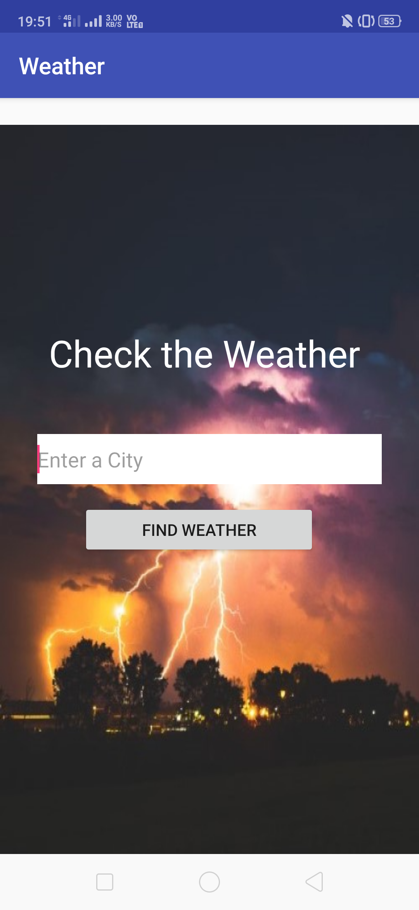
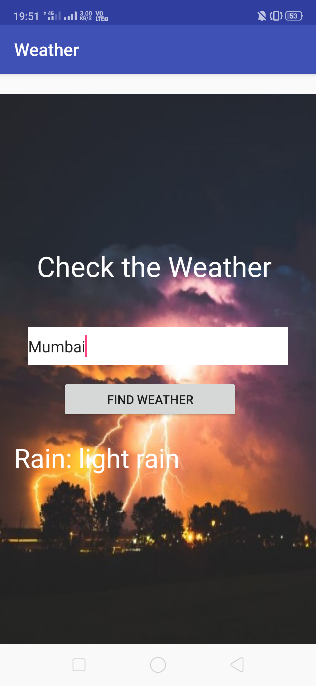

# WeatherApp
## An Android app for checking the weather of places.

It is built on Android Studio 3.0.1

It uses an API of openWeatherMap.org

The App needs Internet Connection.

## How to run this Application
1. Fork this Repository and download or clone this app.
2. Directly run on the Android studio.

## Some of the Screenshots of the Application is below:

